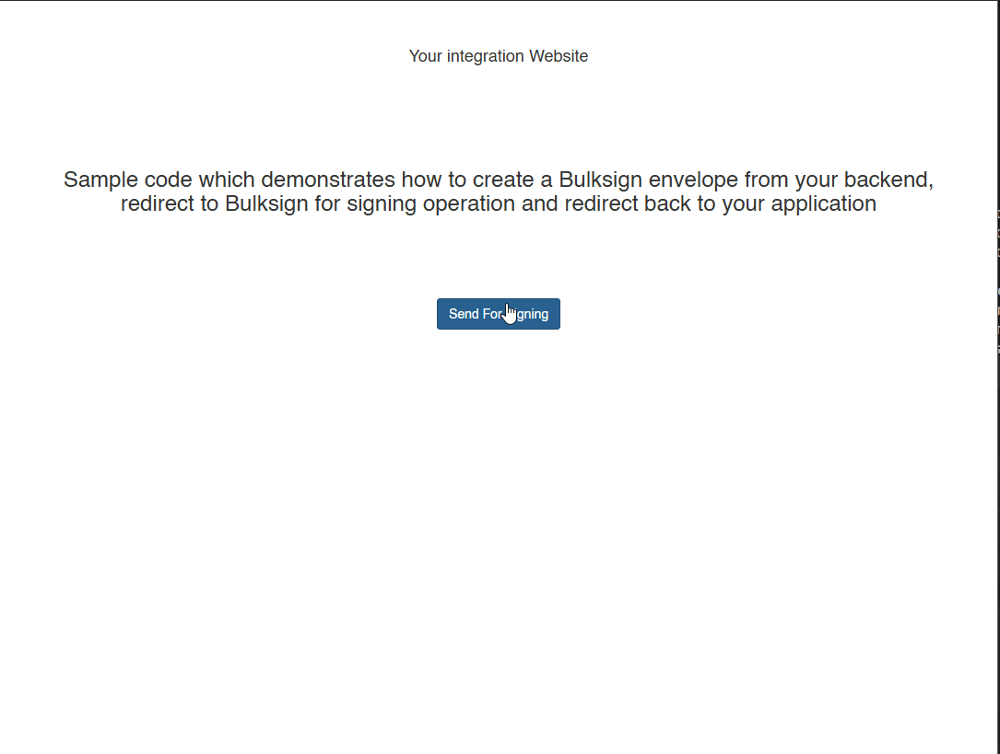

# Signing integration

This demo sample code shows how simple is to integrate digital signatures into your website or application using the Bulksign platform.

# What does this do ?

- when clicking the "Send For Signing" button, a new Bulksign envelope will be created 

- the user gets redirected to Bulksign for signing.

- when user is finishing the signing process, it gets redirected back to the initiating application 

<code>
		envelope.OverwriteSignSettings = new SignSettingsApiModel()
		{

	 		AutomaticFinishAfterSigning = true,
			DocumentDownload = SignerDownloadDocumentActionTypeApi.RedirectToUrl, 
			DocumentDownloadRedirectUrl = "http://localhost/WebSignRedirectIntegration/Home/FinishedSigning/?envelopeId={{#id#}}&email={{#email#}}"
		};
</code>

# How it looks from the user perspective

### Running the code

- create a [Bulksign](http://bulksign.com) account. 
Testing with on-premise version works too, just make sure you set  the Bulksign API endpoint 

<code>
 (BulkSignApi api = new BulkSignApi("http://localhost/bulksignapi/");
</code>

- login, go to Settings\API Token.

- copy the value of the "Default" token

- edit BulksignIntegration.cs and replace the Token constants with your token value.

- build and run the project 

